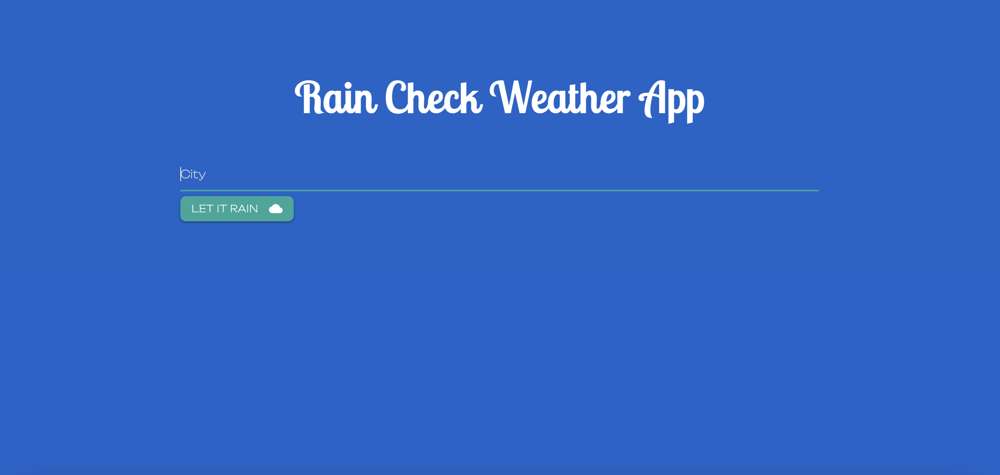

# rain-check

## Description

This weather application, named rain-check, features dynamically updated HyperText Markup Language (HTML) and Cascading Style Sheet (CSS) powered by JavaScript and the third party Application Programming Interfaces (API), jQuery and Server-Side APIs Materialize, Google Fonts and Open Weathermap. In this application, the user is presented with current and future conditions for a specific city they search, and that city is added to the search history. Additionally, when the user is viewing current weather conditions, they are presented with the city name, icon representation of weather conditions, temperatures, humidity, and wind speed. When the user is viewing future weather conditions, they are presented with the 5-day forecast that displays the date, icon representation of weather conditions, temperature, humidity, and wind speed. When the user clicks on a city in the search history, they are presented with current and future conditions for that city.

## Screenshot

## Link to webpage:

https://saramangelo.github.io/rain-check/

## Credits

APIs:

jQuery: https://code.jquery.com/jquery-3.6.2.min.js

Materialize: https://cdnjs.cloudflare.com/ajax/libs/materialize/1.0.0/css/materialize.min.css

Google Fonts: https://fonts.googleapis.com/css2?family=Abril+Fatface&family=Bebas+Neue&family=Limelight&family=Lobster+Two&family=Permanent+Marker&family=Roboto&display=swap

Open Weathermap: (API Key: e84606a3a3ed2806c22526e2f0cab7bd)
Current Weather Data: https://api.openweathermap.org/data/2.5/weather?q={city name}&appid={API key}
5-Day Forecast Data: api.openweathermap.org/data/2.5/forecast?q={city name}&appid={API key}

## License

MIT License

Copyright (c) 2022 saramangelo

Permission is hereby granted, free of charge, to any person obtaining a copy
of this software and associated documentation files (the "Software"), to deal
in the Software without restriction, including without limitation the rights
to use, copy, modify, merge, publish, distribute, sublicense, and/or sell
copies of the Software, and to permit persons to whom the Software is
furnished to do so, subject to the following conditions:

The above copyright notice and this permission notice shall be included in all
copies or substantial portions of the Software.

THE SOFTWARE IS PROVIDED "AS IS", WITHOUT WARRANTY OF ANY KIND, EXPRESS OR
IMPLIED, INCLUDING BUT NOT LIMITED TO THE WARRANTIES OF MERCHANTABILITY,
FITNESS FOR A PARTICULAR PURPOSE AND NONINFRINGEMENT. IN NO EVENT SHALL THE
AUTHORS OR COPYRIGHT HOLDERS BE LIABLE FOR ANY CLAIM, DAMAGES OR OTHER
LIABILITY, WHETHER IN AN ACTION OF CONTRACT, TORT OR OTHERWISE, ARISING FROM,
OUT OF OR IN CONNECTION WITH THE SOFTWARE OR THE USE OR OTHER DEALINGS IN THE
SOFTWARE.

